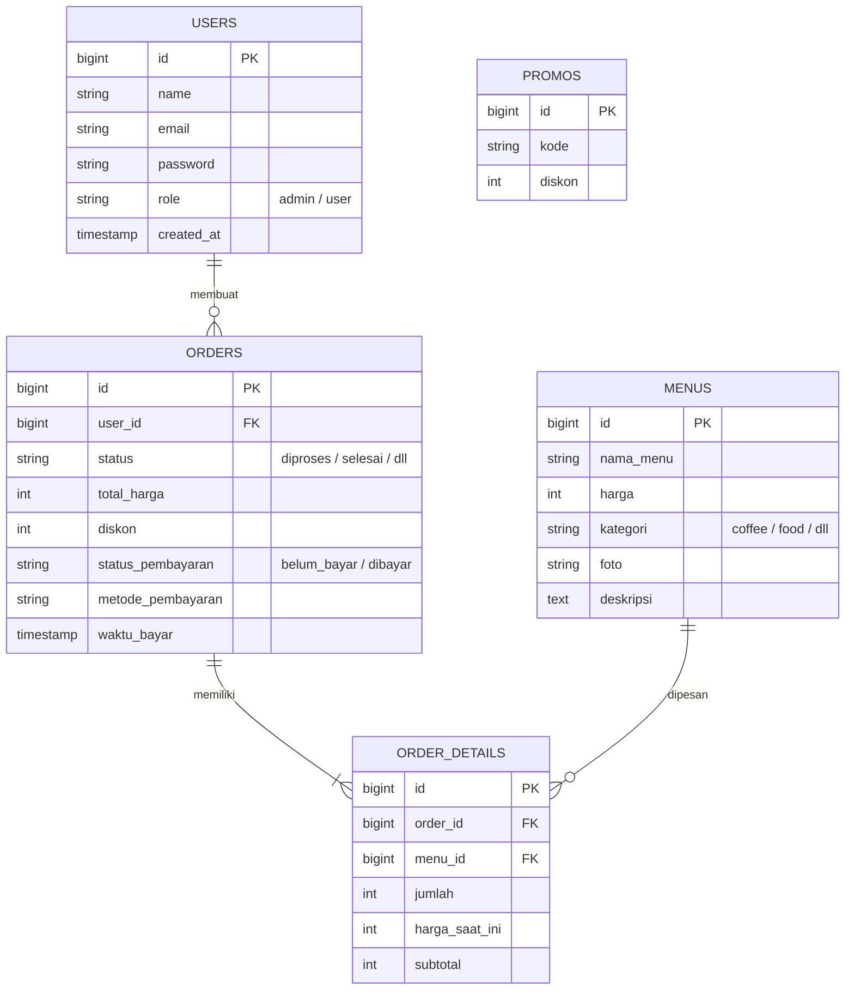

# ☕ Cafe & Resto Ordering System - Tugas Besar PAW

Sistem Informasi Pemesanan Makanan dan Minuman berbasis web yang dirancang untuk memenuhi Tugas Besar Pemrograman Aplikasi Web (PAW). Aplikasi ini dibangun menggunakan framework **Laravel 12** dan dilengkapi dengan dua hak akses utama: **Pelanggan (User)** untuk melakukan pemesanan dan pembayaran, serta **Admin** untuk mengelola menu, kode promo, dan memverifikasi pesanan.

---

## 🚀 Fitur Utama

### 👤 Halaman Pelanggan (User)
- **Registrasi & Login**: Keamanan autentikasi untuk mengakses layanan pemesanan.
- **Pemesanan Menu Terintegrasi**: Memilih menu makanan dan minuman secara dinamis dari berbagai kategori.
- **Sistem Promo/Diskon**: Pelanggan dapat memasukkan kode promo pada halaman pembayaran untuk mendapatkan potongan harga.
- **Pilihan Metode Pembayaran**: Memilih metode pembayaran yang tersedia sebelum menyelesaikan pemesanan.
- **Riwayat Pemesanan (Order History)**: Melacak status pembayaran dan riwayat pesanan yang telah diselesaikan secara real-time.

### 🔑 Halaman Panel Admin (Admin)
- **Dashboard Ringkasan**: Statistik dan informasi singkat aktivitas penjualan di kafe.
- **Manajemen Menu (CRUD)**: Menambah, mengubah, menampilkan, dan menghapus daftar makanan/minuman beserta unggahan foto menu.
- **Manajemen Promo (CRUD)**: Mengatur kode kupon diskon aktif, nilai potongan harga, dan validitasnya.
- **Manajemen Transaksi & Pembayaran**: Memverifikasi bukti pembayaran pelanggan.
- **Pembaruan Status Pesanan**: Mengubah status pengerjaan pesanan (`diproses`, `selesai`).

---

## 🛠️ Teknologi yang Digunakan

- **Framework Core**: Laravel 12 (PHP ^8.2)
- **Frontend Stack**: CSS & JS compiled via Vite, TailwindCSS, Bootstrap 5, Alpine.js, Sass
- **Database Driver**: SQLite (Bawaan / Default) atau MySQL (Kompatibel)
- **Testing Engine**: Pest PHP (Pest 3.x) & Laravel Sail (Docker support)

---

## 📊 Skema Database (Hubungan Antar Tabel)

Berikut adalah visualisasi hubungan tabel pada database menggunakan diagram Mermaid:



---

## ⚙️ Cara Instalasi & Menjalankan Projek

Ikuti langkah-langkah di bawah ini untuk menjalankan projek di komputer lokal Anda:

### 1. Prasyarat Sistem
Pastikan Anda sudah menginstal aplikasi berikut pada komputer Anda:
- PHP versi `8.2` atau lebih tinggi.
- Composer (Package manager PHP).
- Node.js & NPM (Package manager JS).

### 2. Kloning Repositori
```bash
git clone <url-repository-anda>
cd tubesPAW
```

### 3. Setup Otomatis Projek
Projek ini dilengkapi dengan skrip setup otomatis yang akan menginstal dependency PHP & Node, menyalin file `.env` dari konfigurasi contoh, men-generate App Key, serta melakukan migrasi database. Cukup jalankan perintah berikut:
```bash
composer run setup
```

> [!NOTE]
> Secara default, Laravel 12 menggunakan **SQLite** sebagai database-nya. Skrip setup akan otomatis membuat file `database/database.sqlite` jika belum ada.

### 4. Mengisi Data Awal (Seeders)
Untuk mengisi database dengan akun default dan daftar menu bawaan (kopi & makanan), jalankan perintah seeder berikut:
```bash
# Jalankan seeder bawaan (untuk akun admin & user cafe)
php artisan db:seed

# Jalankan seeder menu & seeder user alternatif (opsional)
php artisan db:seed --class=MenuSeeder
php artisan db:seed --class=UserSeeder
```

### 5. Menjalankan Server Pengembangan (Local Development Server)
Untuk menjalankan server Laravel beserta compiler aset frontend (Vite) secara bersamaan, jalankan:
```bash
composer run dev
```

> [!TIP]
> Perintah di atas menggunakan `concurrently` untuk memicu server PHP (`php artisan serve`), Vite development server (`npm run dev`), queue listener, dan tailing logs secara bersamaan dalam satu console.

Akses aplikasi di browser Anda melalui alamat:  
👉 **[http://127.0.0.1:8000](http://127.0.0.1:8000)**

---

## 🔑 Akun Demo (Uji Coba Default)

Berikut adalah kredensial akun bawaan setelah Anda menjalankan proses seeding di atas:

| Peran (Role) | Email | Password | Sumber Seeder | Kegunaan |
| :--- | :--- | :--- | :--- | :--- |
| **Admin** | `admin@cafe.com` | `password` | `DatabaseSeeder` | Mengakses dashboard admin, mengelola menu, promo, verifikasi transaksi |
| **Pelanggan** | `user@cafe.com` | `password` | `DatabaseSeeder` | Memesan menu, memasukkan kode promo, dan melakukan transaksi pembayaran |
| **Admin Alt** | `admin@gmail.com` | `password` | `UserSeeder` | Akun admin alternatif |
| **Pelanggan Alt** | `user@gmail.com` | `password` | `UserSeeder` | Akun pelanggan alternatif |

---

## 📂 Struktur Direktori Utama

- `app/Http/Controllers/` - Logika utama aplikasi (terbagi menjadi folder `Admin` dan controller user).
- `app/Models/` - Definisi model database (User, Menu, Promo, Order, OrderDetail, Product).
- `database/migrations/` - Struktur rancangan tabel database.
- `database/seeders/` - Pengisi data uji coba (DatabaseSeeder, UserSeeder, MenuSeeder).
- `resources/views/` - File tampilan Blade HTML untuk user interface.
- `routes/web.php` - Daftar semua routing URL aplikasi (Admin dan User).
- `vite.config.js` & `package.json` - Konfigurasi compiler aset frontend (Vite).
